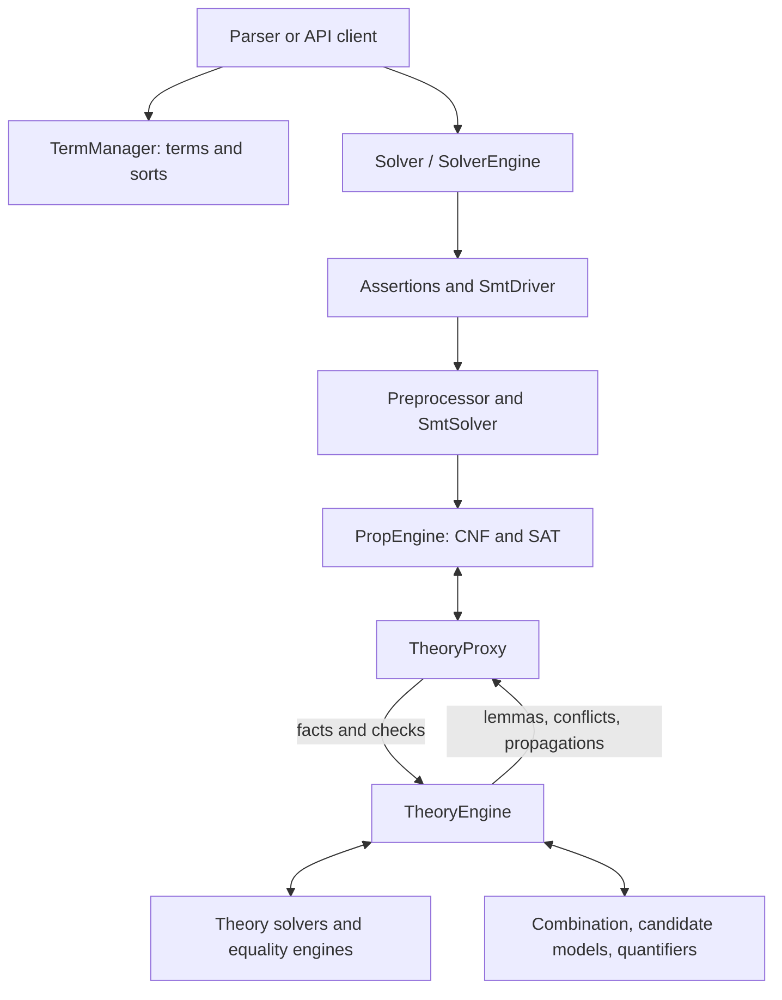

# Walking through cvc5

This is the first draft of paideia's developer guide, an artifact maintained
in `bootcamp/`. It follows a term from construction through preprocessing,
Boolean search, theory reasoning and model construction, then visits each
theory covered by the original bootcamp. The intended reader knows C++ and
the basic idea of SMT and wants to change cvc5.

The account was checked on **2026-09-18** against upstream `main` at
[`3dcc1ef5421ab62cc1ee9af52d70042ce6861af0`](https://github.com/cvc5/cvc5/tree/3dcc1ef5421ab62cc1ee9af52d70042ce6861af0).
“Current” throughout these chapters means that snapshot, whose NEWS calls it
1.4.0 prerelease. Source links are pinned so a later refactor cannot silently
change their evidence. [The source baseline](source-baseline.md) records
the verification limits and how to update the guide.

## A route through the code

Start with [building and navigating](build.md), then read
[terms and ownership](terms.md), [the path of a query](query.md),
[rewriting and preprocessing](preprocessing.md), and
[the theory interface](theory-interface.md). These chapters supply the
vocabulary used by the theory walkthroughs. The
[development workflow](development.md) connects a code change to options,
proof plumbing, tests and debugging.

This is a control-flow map, not an ownership diagram. For example, theories
access the solver's `Env`; nodes belong to a `NodeManager` that can be shared
by several solvers. Neither relationship is shown by a control-flow arrow.

## The theory walkthroughs

Each walkthrough explains preprocessing, term registration, fact processing,
equality notifications, combination and models. “Inherited” means the base
implementation is used; it does not mean that stage never runs.

Read [UF](uf.md) first for congruence closure, then
[arrays](arrays.md) and [datatypes](datatypes.md) for theories with
substantial equality-class bookkeeping. The numeric theories are
[arithmetic](arithmetic.md), [bit-vectors](bit-vectors.md),
[floating point](floating-point.md) and [finite fields](finite-fields.md).
[Strings and sequences](strings.md), [sets and relations](sets.md),
[bags and tables](bags.md), and [separation logic](separation-logic.md)
show several ways of combining local reasoning with other theories. Finish
with [quantifiers and synthesis](quantifiers.md): they work over the
ground solver and its candidate models.

For a particular edit, find the theory's `theory_*.h` first. Read its overrides
alongside the base `Theory` implementation before descending into helpers.
A method's absence is often meaningful. Its presence can also be only a
forwarding layer, especially for arithmetic and bit-vectors.

## Chapters

| Chapter | What it covers |
| --- | --- |
| [`build.md`](build.md) | build configurations, source layout, generation, theory removal and build-time investigation |
| [`terms.md`](terms.md) | API/internal representations, term managers, values, attributes and skolems |
| [`query.md`](query.md) | solver ownership, contexts and the path from assertions through SAT to candidate models |
| [`preprocessing.md`](preprocessing.md) | rewriting, assertion passes, substitutions, term formulas and proof-aware transformations |
| [`theory-interface.md`](theory-interface.md) | routing, callbacks, inference, equality, combination and model contracts |
| [`uf.md`](uf.md) | congruence, higher-order functions, cardinality, conversions and distinct constraints |
| [`arrays.md`](arrays.md) | read-over-write, extensionality, optional weak equivalence and array models |
| [`datatypes.md`](datatypes.md) | constructor/tester/selector state, cycles, splitting and model skeletons |
| [`arithmetic.md`](arithmetic.md) | linear constraints, integer checking, nonlinear refinement and arithmetic models |
| [`bit-vectors.md`](bit-vectors.md) | separate/internal bit blasting, abstraction, sharing and bit-vector values |
| [`floating-point.md`](floating-point.md) | totalization, word blasting, constant folding and real-conversion refinement |
| [`finite-fields.md`](finite-fields.md) | polynomial encoding, Gröbner bases, conflict cores and finite-field root search |
| [`strings.md`](strings.md) | string/sequence subsolvers, registration, strategies, lengths and model construction |
| [`sets.md`](sets.md) | membership closure, relations, cardinality, equality callbacks and set models |
| [`bags.md`](bags.md) | count reasoning, quantified operations, tables and multiplicity-preserving models |
| [`separation-logic.md`](separation-logic.md) | heap labels, spatial reduction, last-call refinement and heap-model output |
| [`quantifiers.md`](quantifiers.md) | module scheduling, instantiation, completeness, models and synthesis |
| [`development.md`](development.md) | implementing an operator/inference, proof plumbing, options, debugging and tests |
| [`bootcamp-coverage.md`](bootcamp-coverage.md) | every bootcamp topic's destination, material corrections and added topics |
| [`source-baseline.md`](source-baseline.md) | exact upstream revision, verification limits, mechanical checks and update procedure |

## Using the bootcamp

The supplied `cvc5-Bootcamp.docx` sets the subject coverage. It is a set of
working notes, with questions, proposed renamings and incomplete sections.
This guide expands those notes into explanations and checks claims against
code; it does not assume a suggestion in the document was implemented.
The [coverage and corrections table](bootcamp-coverage.md) accounts for
all its sections, including build-time theory selection and build performance.
Reading the guide does not require the original document.

This artifact describes implementation and engineering contracts; it does not
certify cvc5's answers or the correctness of an emitted proof.
