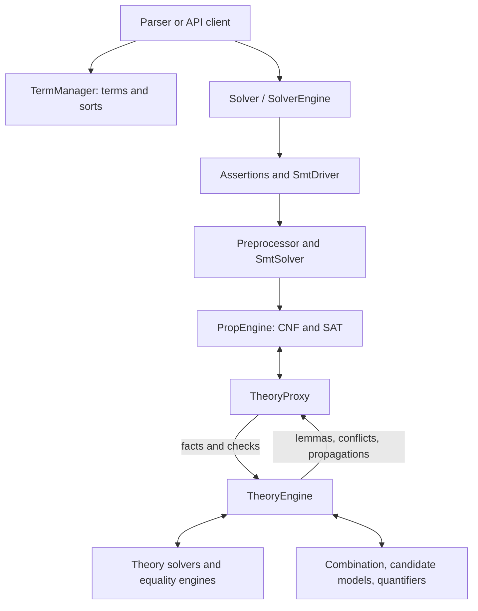

# Walking through cvc5

This is paideia's developer guide, an artifact maintained
in `bootcamp/`. It follows a term from construction through preprocessing,
Boolean search, theory reasoning and model construction, then visits each
theory covered by the original bootcamp. The intended reader knows C++ and
the basic idea of SMT and wants to change cvc5.

The account was checked on **2026-09-18** against upstream `main` at
[`3dcc1ef5421ab62cc1ee9af52d70042ce6861af0`](https://github.com/cvc5/cvc5/tree/3dcc1ef5421ab62cc1ee9af52d70042ce6861af0).
“Current” throughout these chapters means that snapshot, whose NEWS calls it
1.4.0 prerelease. Source links are pinned so a later refactor cannot silently
change their evidence. [The source baseline](source-baseline.md) records
the verification limits and how to update the guide.

## A route through the code

Start with [building and navigating](build.md), then read the architecture
foundations: [terms and ownership](terms.md), [the path of a query](query.md)
and [rewriting and preprocessing](preprocessing.md). Continue to
[How to develop a theory](theory-development/README.md), which supplies a
shared workflow, the common theory contract and a sub-guide for each theory.
Use [Making and investigating a change](development.md) for the repository-wide
work around options, proof plumbing, tests and debugging.

The [research bibliography](references.md) connects the tutorials to the
CVC4/cvc5 literature, with primary paper links and notes about the relevant
examples, algorithms and implementation classes. Begin with the
[cvc5 system paper](references.md#cvc5-2022) and the
[SMT beginner's tutorial](references.md#smt-tutorial-2024), then follow the
citations within each chapter. Every retained paper has an explicit connection
to the pinned `main` source; notes identify which part of a paper is relevant.[1](unreferenced-papers.md)

This is a control-flow map, not an ownership diagram. For example, theories
access the solver's `Env`; nodes belong to a `NodeManager` that can be shared
by several solvers. Neither relationship is shown by a control-flow arrow.

## Reading and running the examples

For a practical first session, build the pinned checkout, run the
[three-check query](query.md#a-small-query-to-trace), inspect the
[conditional-term example](preprocessing.md#worked-example-a-conditional-inside-a-function-application),
then follow the [singleton rewrite](development.md#worked-change-investigation-membership-in-a-singleton)
from source to regression. These exercises connect the architecture before
you choose a specialized theory. Each theory chapter also has a complete
SMT-LIB input, an explanation of its expected result, source-reading stops,
and variations that test a different obligation.

Commands assume a cvc5 source checkout with the executable at
`build-dev/bin/cvc5`, created by the [build recipe](build.md#build-a-version-you-can-investigate).
Save a chapter's complete `smt2` block under the filename it gives, then
run its command from that checkout. These are tutorial inputs to copy;
they are not files already installed in a cvc5 clone. `cpp` fragments are
explicitly labeled where they omit a complete program.

An **expected result** follows from the formula's semantics. A **source-reading
path** identifies the implementation to inspect. Neither promises an exact
trace: preprocessing, logic, options and backend selection determine which
callbacks an actual run reaches. Inspect `-o post-asserts -o subs` before
concluding that a breakpoint or inference is missing. Returned model values
can vary when the input does not determine them uniquely.

The [validation record](source-baseline.md#validation-of-the-expanded-examples)
distinguishes source checks against current `main` from smoke runs with the
older executable available during this revision. The finite-field example
requires a CoCoA-enabled build. Feature-restricted builds can reject examples
using experimental theories; the debug build recipe is the starting point.

### Vocabulary used along the way

| Term | Meaning in this guide |
| --- | --- |
| Term / node | An expression, or its internal DAG representation; a Boolean formula is also a term |
| Atom / literal | A Boolean variable or indivisible Boolean constraint, such as `x < y`; a literal is an atom or its negation |
| Fact | A literal delivered as holding in the current context; registration alone does not make a term a fact |
| Rewrite | A transformation of a term; its phase determines which assumptions and auxiliary definitions are allowed |
| Lemma / explanation | A constraint returned to search / the reasons a conditional deduction follows |
| Equality class | Terms known equal in an equality engine; its representative is one chosen member |
| Candidate model | A proposed interpretation still subject to theory checks, combination and refinement |
| Context | State with a backtracking boundary; SAT branches and user push/pop scopes are different boundaries |

The [common theory interface](theory-development/interface.md) expands these
distinctions where they affect implementation.

## Chapters

### Architecture foundations

These chapters explain the objects and query pipeline that theory development
builds on.

| Chapter | What it covers |
| --- | --- |
| [Terms, types and ownership](terms.md) | API/internal representations, term managers, values, attributes and skolems |
| [The path of a query](query.md) | Solver ownership, contexts and the path from assertions through SAT to candidate models |
| [Rewriting and preprocessing](preprocessing.md) | Assertion passes, substitutions, term formulas and proof-aware transformations |

### How to develop a theory

[Enter the theory-development category](theory-development/README.md) for the
shared development workflow and the common interface, then choose one of its
**twelve theory sub-guides**. Each instantiates the same six stages:
representation, preprocessing and registration, fact processing, equality and
combination, model construction, and developing and validating a change.

The category covers UF, arrays, datatypes, arithmetic, bit-vectors, floating
point, finite fields, strings and sequences, sets and relations, bags and
tables, separation logic, and quantifiers and synthesis. The detailed chapter
index lives with those sub-guides, alongside their shared contract.

### General development workflow

| Chapter | What it covers |
| --- | --- |
| [Building and navigating](build.md) | Build configurations, source layout, generation, theory removal and build-time investigation |
| [Making and investigating a change](development.md) | Implementing an operator/inference, proof plumbing, options, debugging and tests |

### Coverage and maintenance

| Reference | What it records |
| --- | --- |
| [Research references and code connections](references.md) | CVC4/cvc5 papers by topic, primary links, stable citation keys and tutorial/code reading notes |
| [Bootcamp coverage and corrections](bootcamp-coverage.md) | Every original bootcamp topic's destination, material corrections and added topics |
| [Source baseline and updates](source-baseline.md) | Exact upstream revision, verification limits, mechanical checks and update procedure |

## Using the bootcamp

The supplied `cvc5-Bootcamp.docx` sets the subject coverage. It is a set of
working notes, with questions, proposed renamings and incomplete sections.
This guide expands those notes into explanations and checks claims against
code; it does not assume a suggestion in the document was implemented.
The [coverage and corrections table](bootcamp-coverage.md) accounts for
all its sections, including build-time theory selection and build performance.
Reading the guide does not require the original document.

This artifact describes implementation and engineering contracts; it does not
certify cvc5's answers or the correctness of an emitted proof.

---

1 **[Unreferenced papers](unreferenced-papers.md).** Papers describing
features absent from the pinned code and this tutorial's feature account, with
paper claims, source evidence and links to research implementations. The audit
distinguishes experimental features and partial integrations from established
deprecation or incorrect claims.
