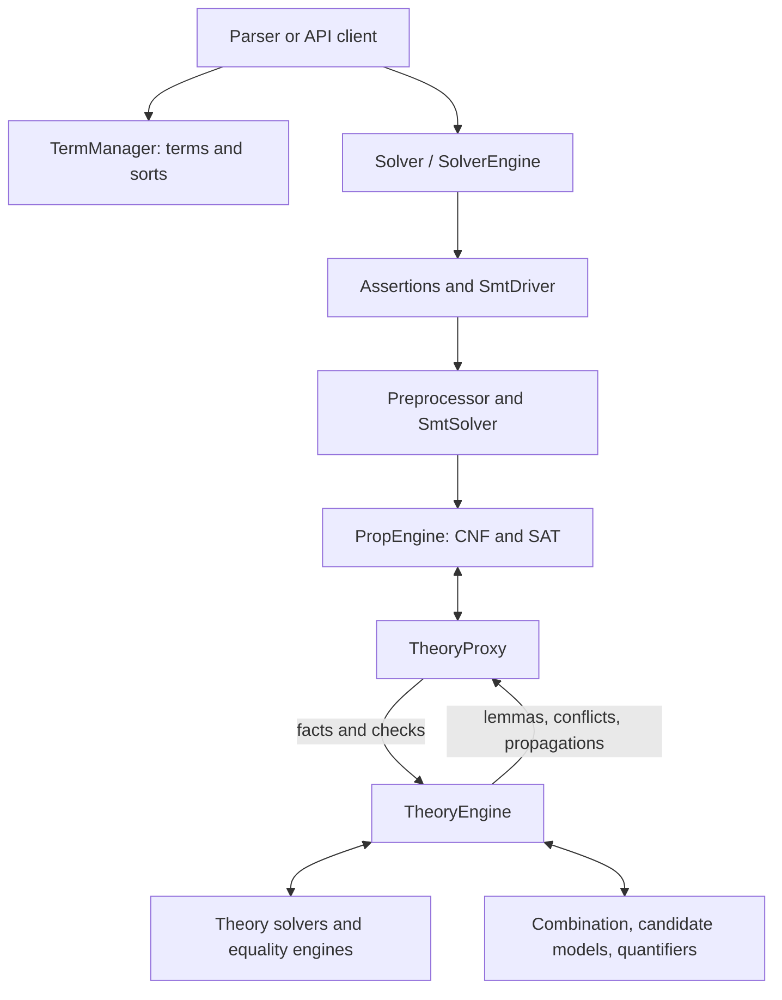

# Overall architecture and chapter guide

[Bootcamp](README.md) / Overall architecture

This is the detailed map of the bootcamp: the reading route, solver pipeline,
shared vocabulary and full chapter index. For an introduction to SMT solvers
and cvc5, start with [Walking through cvc5](README.md).

This is paideia's developer guide, an artifact maintained
in `bootcamp/`. It follows a term from construction through preprocessing,
Boolean search, theory reasoning and model construction, then visits each
theory covered by the original bootcamp. The intended reader can read C++ and
wants to investigate or make a small cvc5 change. You do not need to have
implemented an SMT solver. The examples introduce the required SMT-LIB syntax
and solver concepts before following them into classes and callbacks.

cvc5 answers whether a collection of logical constraints can all hold at once.
For example, over integers, `x > 3` and `x < 5` can both hold: choose `x = 4`.
Adding `x != 4` makes them impossible to satisfy together. These outcomes are
called **satisfiable** (`sat`) and **unsatisfiable** (`unsat`). A **model** is
an interpretation of the symbols that satisfies the constraints; it can assign
values to variables and meanings to functions. `unknown` means that the solver
did not establish either answer.

**SMT** means *satisfiability modulo theories*. A theory gives operations their
meaning: arithmetic fixes what `+` means, while the array theory fixes how a
read relates to a write. Boolean search explores choices such as which side
of an `or` holds; theory solvers check whether those choices make mathematical
sense. This cooperation, and the transformations that prepare expressions for
it, are the subject of the guide.

The account was checked on **2026-09-18** against upstream `main` at
[`3dcc1ef5421ab62cc1ee9af52d70042ce6861af0`](https://github.com/cvc5/cvc5/tree/3dcc1ef5421ab62cc1ee9af52d70042ce6861af0).
“Current” throughout these chapters means that snapshot, whose NEWS calls it
1.4.0 prerelease. Source links are pinned so a later refactor cannot silently
change their evidence. [The source baseline](source-baseline.md) records
the verification limits and how to update the guide.

## A route through the code

There are two ways to use this guide. On a first reading, follow the short
route below and work the opening examples. When changing an implementation,
return to its detailed sections and source links. You do not need to read all
twelve theory implementations before making a first change.

| Step | Read and do | Check your understanding |
| --- | --- | --- |
| 1 | [Build](build.md#build-a-version-you-can-investigate) and run the [three-check query](query.md#a-small-query-to-trace) | Explain why its answers are `sat`, `unsat`, `sat` |
| 2 | [Follow an inference](observing.md) on that query | Find a surviving term, an event or simplification, and its source routine |
| 3 | Read [terms](terms.md) and the [preprocessing example](preprocessing.md#worked-example-a-conditional-inside-a-function-application) | Distinguish expression identity, equivalent rewriting and an auxiliary definition |
| 4 | Read the [common interface](theory-development/interface.md), then the opening [UF](theory-development/uf.md) and [array](theory-development/arrays.md) exercises | Identify a deduction's premises and why they must remain in its explanation |
| 5 | Follow the [singleton rewrite investigation](development.md#worked-change-investigation-membership-in-a-singleton) | Connect a semantic rule, its implementation and a regression that would catch a wrong rule |

The query's `x`, `y` and `f` continue through the observation, term and theory
interface chapters. Specialized theory chapters introduce their own small
problems when a new mathematical object is needed. Each starts with a question,
a runnable example, a useful variation and diagnostics to connect it to code.
The six implementation sections after the example are reference material.

Use [advanced topics](advanced.md) when a result is surprising or a run stalls.
They cover the diagnostic interfaces in the
[Interfaces for Understanding cvc5 blog post](https://cvc5.github.io/blog/2024/04/15/interfaces-for-understanding-cvc5.html),
including cores, proofs, models, incompleteness and quantifier behavior.

The [research bibliography](references.md) connects the tutorials to the
CVC4/cvc5 literature, with primary paper links and notes about the relevant
examples, algorithms and implementation classes. Begin with the
[cvc5 system paper](references.md#cvc5-2022) and the
[SMT beginner's tutorial](references.md#smt-tutorial-2024), then follow the
citations within each chapter. Every retained paper has an explicit connection
to the pinned `main` source; notes identify which part of a paper is relevant.[1](unreferenced-papers.md)

This is a control-flow map, not an ownership diagram. For example, theories
access the solver's `Env`; nodes belong to a `NodeManager` that can be shared
by several solvers. Neither relationship is shown by a control-flow arrow.

## Reading and running the examples

The examples use **SMT-LIB**, a text language for describing solver commands
and formulas. Operations use prefix notation: `(+ x 1)` means `x + 1`,
`(= x y)` means equality, and `(distinct x y)` means disequality.
`declare-const` introduces an unknown value of a given type; `assert` adds a
constraint; `check-sat` asks whether the active constraints can all hold.
`set-logic` selects the intended theory combination. A `QF_` prefix means
*quantifier-free*; `ALL` selects a broad combination. Each worked example
explains the mathematics separately from this syntax.

For each example, predict the result before running it. Then inspect one
relevant transformation or inference and try the suggested variation. A
refutation paired with a satisfiable case often reveals a missing premise
more clearly than two similar refutations.

Commands assume a cvc5 source checkout with the executable at
`build-dev/bin/cvc5`, created by the [build recipe](build.md#build-a-version-you-can-investigate).
Save a chapter's complete `smt2` block under the filename it gives, then
run its command from that checkout. These are tutorial inputs to copy;
they are not files already installed in a cvc5 clone. `cpp` fragments are
explicitly labeled where they omit a complete program.

An **expected result** follows from the formula's semantics. A **source-reading
path** identifies the implementation to inspect. Neither promises an exact
trace: preprocessing, logic, options and backend selection determine which
callbacks an actual run reaches. Inspect `-o post-asserts -o subs` before
concluding that a breakpoint or inference is missing. Returned model values
can vary when the input does not determine them uniquely.

The [validation record](source-baseline.md#validation-of-the-expanded-examples)
distinguishes source checks against current `main` from smoke runs with the
older executable available during this revision. The finite-field example
requires a CoCoA-enabled build. Feature-restricted builds can reject examples
using experimental theories; the debug build recipe is the starting point.

### Vocabulary used along the way

| Term | Meaning in this guide |
| --- | --- |
| Satisfiable / valid | Satisfiable means true in at least one allowed interpretation; valid means true in every allowed interpretation |
| Term / node | An expression, or a vertex in its internal shared expression graph; a Boolean formula is also a term |
| Sort / type | The domain of a term's values, such as integers, Booleans or arrays |
| Atom / literal | A Boolean variable or indivisible Boolean constraint, such as `x < y`; a literal is an atom or its negation |
| Ground | Contains no variables bound by a quantifier or lambda; a declared unknown such as `a` can still occur in a ground term |
| Fact | A literal delivered as holding in the current context; registration alone does not make a term a fact |
| Inference | A reasoning step that derives a conclusion from premises using a rule |
| Ordinary rewrite | Replacement by an equivalent term, independent of the current assertions or search branch; used throughout solving |
| Preprocessing | Transformation of assertions before search, normally preserving satisfiability; may use other assertions or introduce auxiliary definitions |
| Lemma / explanation | A valid constraint added to search / the premises justifying a deduction under current facts |
| Equality class | Terms known equal in an equality engine; its representative is one chosen member |
| Candidate model | A proposed interpretation still subject to theory checks, combination and refinement |
| Context | State with a backtracking boundary; SAT branches and user push/pop scopes are different boundaries |
| Eager / lazy | Performing work as soon as possible / deferring it until a later stage or until needed |
| Sound / complete | Sound reasoning draws only justified conclusions; a complete decision procedure can settle every input in its stated fragment, given sufficient resources |

The [common theory interface](theory-development/interface.md) expands these
distinctions where they affect implementation.

## Chapters

### Architecture foundations

These chapters explain the objects and query pipeline that theory development
builds on.

| Chapter | What it covers |
| --- | --- |
| [Following an inference](observing.md) | A practical first session with output tags, `-t im`, inference identifiers and source searches |
| [Terms, types and ownership](terms.md) | API/internal representations, term managers, values, attributes and skolems |
| [The path of a query](query.md) | Solver ownership, contexts and the path from assertions through SAT to candidate models |
| [Rewriting and preprocessing](preprocessing.md) | Assertion passes, substitutions, term formulas and proof-aware transformations |

### How to develop a theory

[Enter the theory-development category](theory-development/README.md) for the
shared development workflow and the common interface, then choose one of its
**twelve theory sub-guides**. Each instantiates the same six stages:
representation, preprocessing and registration, fact processing, equality and
combination, model construction, and developing and validating a change.

The category covers UF, arrays, datatypes, arithmetic, bit-vectors, floating
point, finite fields, strings and sequences, sets and relations, bags and
tables, separation logic, and quantifiers and synthesis. The detailed chapter
index lives with those sub-guides, alongside their shared contract.

### General development workflow

| Chapter | What it covers |
| --- | --- |
| [Building and navigating](build.md) | Build configurations, source layout, generation, theory removal and build-time investigation |
| [Making and investigating a change](development.md) | A rewrite-to-regression exercise, then operator/inference, proof, option and test interfaces |
| [Advanced topics: understanding results and stalled runs](advanced.md) | Cores, proof components, models, timeout diagnosis, difficulty, learned literals, instantiations and synthesis diagnostics |

### Coverage and maintenance

| Reference | What it records |
| --- | --- |
| [Research references and code connections](references.md) | CVC4/cvc5 papers by topic, primary links, stable citation keys and tutorial/code reading notes |
| [Bootcamp coverage and corrections](bootcamp-coverage.md) | Every original bootcamp topic's destination, material corrections and added topics |
| [Source baseline and updates](source-baseline.md) | Exact upstream revision, verification limits, mechanical checks and update procedure |

## Using the bootcamp

The [coverage and corrections table](bootcamp-coverage.md) maps the original
bootcamp notes to this guide, including build-time theory selection and build
performance. The guide expands those notes into explanations and checks claims
against code; it does not assume a suggestion in the notes was implemented.
Reading the guide does not require the original notes.

This artifact describes implementation and engineering contracts; it does not
certify cvc5's answers or the correctness of an emitted proof.

---

1 **[Unreferenced papers](unreferenced-papers.md).** Papers describing
features absent from the pinned code and this tutorial's feature account, with
paper claims, source evidence and links to research implementations. The audit
distinguishes experimental features and partial integrations from established
deprecation or incorrect claims.
