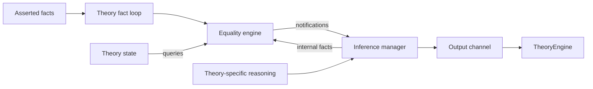

# The theory interface, equality and models

[Bootcamp](../README.md) / [How to develop a theory](README.md) / Common interface

This chapter explains how specialized solvers cooperate on one problem.
Boolean search proposes which constraints hold. Each theory checks the
constraints it understands and communicates consequences, contradictions or
additional choices through a common interface. The **theory engine** coordinates
that exchange; a **callback** is an entry point it or another component invokes
when an event, such as a new fact or an equality merge, occurs.

Consider integer terms `x,y` and a function `f`. Arithmetic can infer `x = y`
from `x <= y` and `y <= x`. Function reasoning then knows `f(x) = f(y)` and
can reject an asserted disequality between them. The components must share
the relevant equality, explain why it holds, and withdraw branch-dependent
information on backtracking. The interface exists to make those obligations
explicit across different algorithms.

Source baseline: [2026-09-18](../source-baseline.md). Read
[theory.h][theory-h] together with [theory.cpp][theory-cpp]; the base class
implements much of the protocol described here.

## Follow one exchange before reading the contract

Use the [three-check query](../query.md#a-small-query-to-trace) from the first
chapter. Its middle check requires arithmetic and function reasoning to agree
on the arguments' equality. Run:

```sh
build-dev/bin/cvc5 -o post-asserts -o lemmas query.smt2
build-dev/bin/cvc5 -t theory-check -t im query.smt2
```

Find a literal delivered for checking, then an output event. Decide whether
the event is an internal fact, a lemma or a conflict before reading its
formula. The [observation guide](../observing.md#read-the-event-before-the-formula)
explains the formats, including conflict polarity. The intended checkpoint
is being able to connect one event to its premises and its receiving component.

For a first reading, continue through the component diagram, output-contract
table and fact loop. Return to routing policies, equality-engine setup and
model interfaces as your selected theory needs them. The callback inventory
is a reference; you do not need to memorize it before trying the UF exercise.

## Which theory receives a literal?

A **literal** is an atomic Boolean constraint or its negation. A theory's
**ownership** of a literal means responsibility for reasoning about it; it is
separate from C++ memory ownership. For example, `x < y` calls for arithmetic,
while equality between arrays calls for array reasoning. Routing must also
handle expressions whose subterms come from several theories.

For ordinary theory atoms, routing selects a primary owner. In type-based
mode, a variable belongs to the theory of its type, an equality belongs to the
theory of its operands' type, and other terms are assigned by kind. In
term-based mode, non-Boolean variables go to UF and equality ownership also
depends on the owners of its two sides. If their owners differ, parametric
theories and type ownership determine the choice. This lets some equalities
be handled through cheaper congruence reasoning.

Use `Env::theoryOf` for the effective policy: it incorporates the selected
uninterpreted-sort owner and the special routing of Boolean term skolems to
UF. Calling the static helper with an assumed default can miss those cases.
“One owner” does not mean “only one theory ever sees information about this
term.” Shared terms, equalities and combination deliberately cross boundaries.

The routing implementation is in [Theory::theoryOf][theory-cpp] and
[Env][env]. The modes are declared in [theory_options.toml][options].

## The common pieces of a theory

A theory usually has a rewriter, state object and inference manager. Many also
use an official equality engine, configured through `needsEqualityEngine` and
`EeSetupInfo` and supplied before `finishInit`. The arrangement is common,
not mandatory: quantifiers and bit-vector backends can handle facts without
the usual official-engine assertion path.

`TheoryState` provides access to equality/shared-term information and conflict
state. [TheoryInferenceManager][im] connects derived facts, propagations,
conflicts and lemmas to the theory's output channel. A theory can subclass
these pieces to add queues and specialized explanations. The base `Theory`
stores the output-channel pointer; saying that the inference manager “owns
the output channel” would be misleading about C++ ownership.



The arrows show information flow.
Equality notifications can also update theory-specific state; the exact
callback delegation and any pending queues depend on the theory.

Keep the kinds of output separate. An internal fact enriches local reasoning;
a propagation tells SAT that an existing literal follows from current facts;
a conflict explains an inconsistent conjunction; a lemma adds a valid
constraint, often involving new atoms. A lemma derived under assumptions must
include those assumptions as guards or otherwise use the proper conditional
inference mechanism. A bare conclusion is not made valid by being useful on
the current branch.

Sending output can cause preprocessing, SAT-atom creation and preregistration
of new terms. It can also trigger equality callbacks. Code that is midway
through updating an index must consider **reentrancy**: an outgoing call can
cause a callback into the theory before the original method has finished.
Pending-inference queues let a solver finish a local phase before exposing its
output; they are part of the algorithm, not incidental buffering.

### One deduction, several output contracts

Suppose an array theory knows `i != j`. Let `r` abbreviate the consequence
`select(store(a,i,v),j) = select(a,j)`. Here `r` names the entire equality,
not a new SMT symbol.

| Output | Information it must preserve |
| --- | --- |
| Internal fact `r` | Its reason `i != j`, so local equality reasoning can explain it later |
| Propagation of `r` | A SAT-visible literal and an explanation in terms of the current asserted facts |
| Conflict after learning `not r` | The conjunction `i != j and not r` that cannot hold |
| Lemma | The guarded formula `i = j or r`, valid independently of this branch |

Read [assertInternalFact][internal-fact], [lemmaExp][lemma-exp] and
[conflict][conflict] to see how the inference manager carries these
contracts. Specialized managers may queue the operation or use a proof-aware
wrapper. Do not copy a call signature from another theory without checking
the meaning of its explanation arguments and the receiving manager's policy.

The inference identifier says which reasoning step produced the output;
the explanation says why it follows here. Neither replaces the other.
Likewise, an equality engine's representative is a convenient class member,
not an explanation of why every term in that class equals it.

## The fact-processing skeleton

**Preregistration** tells a theory that a term exists so it can prepare its
indices and notifications. **Fact processing** tells it that a particular
literal holds on the current branch. Registering `x = y` does not yet assert
that equality. The callbacks below let a theory perform work around the
common loop that consumes newly asserted facts.

The **polarity** of a literal records whether an atom is asserted positively
or negatively: `x = y` has positive polarity and `not (x = y)` has negative
polarity. The fact loop passes the atom and this Boolean flag separately,
so both forms can use the same theory callback.

`Theory::check(effort)` has an early-exit optimization for an empty queue below
full effort. Otherwise its central sequence is:

```text
if preCheck(effort): return
while facts remain and theory state is not in conflict:
    remove next fact; split into atom and polarity
    if preNotifyFact(atom, polarity, fact, isPreregistered, false):
        continue
    assert equality or predicate to the official equality engine
    notifyFact(atom, polarity, fact, false)
postCheck(effort)
```

`preCheck` returning true skips the rest of that call. `preNotifyFact`
returning true means that the theory has taken responsibility for the fact;
it skips **both** the base equality assertion and the subsequent base
`notifyFact` call. This distinction explains the quantifier and bit-blasting
implementations. Their missing work is not hidden in `notifyFact`.

The `isInternal` argument distinguishes facts inferred within the theory
from facts delivered through this input queue. Internal inference paths may
notify a theory directly. If you introduce a term in a local fact, account for
whether it has ever been preregistered; strings explicitly handles this case.

| Hook | Base behavior and intended use |
| --- | --- |
| `ppRewrite`, `ppStaticRewrite` | No theory-specific transformation by default |
| `ppAssert` | Attempts legal simple variable elimination |
| `preRegisterTerm` | No-op by default; override for triggers and indices |
| `preCheck` | Returns false; override for work before the fact queue or an early return |
| `preNotifyFact` | Returns false; override to intercept or inspect a fact |
| `notifyFact` | No-op after the equality engine accepted a fact |
| `postCheck` | No-op; often the main strategy loop in an override |
| `notifySharedTerm` | No theory-specific action; base shared-term registration still occurs |
| `getEqualityStatus` | Asks the official engine, otherwise returns unknown |

These defaults matter when the individual theory chapters say a hook is
inherited. An absent override is not evidence that an input never reaches it.

For the algorithmic pattern behind theory-specific refinements, read
[EXTENSIONS-2017](../references.md#extensions-2017). Relate an extension's
new lemma to the fact, conflict and propagation contracts above: a valid
conditional deduction still needs its premises when it crosses the boundary.
[FLEXIBLE-PROOFS-2022](../references.md#flexible-proofs-2022) explains the
corresponding proof-production obligation.

## Effort levels are a scheduling contract

Search need not run every available reasoning procedure after every new fact.
Cheap deductions can prune a partial branch; more expensive work is needed
before accepting a candidate answer. **Effort** names these stages of work,
rather than a timeout or a numerical measure of how difficult an input is.

`EFFORT_STANDARD` is the ordinary propagation/checking stage during Boolean
search. `EFFORT_FULL` asks theories to resolve a candidate assignment or add
the constraints needed to continue. `EFFORT_LAST_CALL` supports work after a
full-effort fixed point, frequently using a candidate model.

A solver should not eagerly run every expensive procedure on every partial
assignment. Conversely, returning from full effort with unhandled constraints
and no incompleteness signal can let an unjustified candidate escape. The
`TheoryEngine` owns the outer scheduling loop; each theory's `postCheck` and
`needsCheckLastEffort` explain its local obligations.

## Equality engines and their notifications

An equality engine groups terms known to denote the same value into
**equivalence classes**. If `a = b` and `b = c`, all three join one class.
It also maintains **congruence**: equal arguments to the same function give
equal results, so `a = b` implies `f(a) = f(b)`. **Congruence closure** is the
process of maintaining all such consequences for the registered terms.
A class **representative** is a chosen member used for bookkeeping; it need
not be a concrete value. Notifications let a theory update its own information
when these classes change.

[EqualityEngine][ee] provides congruence closure, predicate/equality assertions,
disequalities, triggers and explanations. For registered function kinds,
equal arguments imply equal applications. A trigger predicate requests a
notification when an atom becomes true or false; a trigger term supports
sharing and notifications about equality to another tagged term.

The [notification interface][notify] distinguishes:

| Callback | Why a theory uses it |
| --- | --- |
| `eqNotifyTriggerPredicate` | Propagate a known Boolean atom |
| `eqNotifyTriggerTermEquality` | Communicate equality/disequality of tagged shared terms |
| `eqNotifyConstantTermMerge` | Report a collision between distinct canonical values |
| `eqNotifyNewClass` | Allocate or initialize metadata for a new equivalence class |
| `eqNotifyMerge` | Combine class metadata and derive consequences after a merge |
| `eqNotifyDisequal` | Record or react to a known disequality and its reason |

After a constant-term collision, the engine suspends normal work; explanations
remain available. Do not continue treating it as an ordinary consistent
congruence database. Class metadata must also backtrack with the equalities it
describes. For example, merging two singleton-set classes yields equality of
their elements; retaining that merge's metadata after SAT backtracking would
corrupt later reasoning.

### What must roll back with a merge

Imagine two set classes with metadata `A = {a}` and `B = {b}`. On a branch
where `A = B`, the merge can imply `a = b`. The class metadata, that local
consequence and the reasons supporting it must remain consistent as the SAT
context changes. If the branch is abandoned, a later branch can again have
`A != B` and `a != b`.

Restoring only the equality engine is insufficient if a separate ordinary
map still says that `A` has `B`'s singleton information. Use the
[context-dependent object][cdo] or an appropriate context container for such
state, or rebuild it from valid facts as the [bag solver](bags.md#equality-and-combination)
does for much of its indexing. A SAT backtrack can happen without a user
`pop`; a regression that only makes one satisfiability check can still
exercise multiple branch contexts. The
[incremental query](../query.md#a-small-query-to-trace) adds a separate user
scope boundary to test.

[EqEngineManager][eem] handles setup and lifetime of engines. The default
policy is distributed. A central policy exists, but it is not literally one
engine replacing every theory's internal data structure: current
`Theory::expUsingCentralEqualityEngine` excludes arithmetic and arrays, and
theories may have auxiliary engines. Inspect the selected policy before
assuming two theories' engine pointers or representatives are interchangeable.

## Combination asks the equalities that matter

Two theories can each accept their local constraints while disagreeing about
the same values. **Theory combination** coordinates them through shared terms
and their equalities. In the `f(x), f(y)` example, whether `x = y` matters to
both arithmetic and function reasoning. A **care graph** records pairs whose
equality needs attention so combination can focus on relevant choices.

Theories share terms through the shared-solver and combination infrastructure.
A care pair is a pair of shared terms whose equality relationship matters to
a theory's congruence or model construction. Care graphs avoid splitting on
all possible shared-term pairs. The theory proposes relevant pairs and the
combination machinery coordinates them.

The ordinary base care-graph implementation is conservative; many theories
specialize it using application indices. Parametric operators require
compatible types as well as compatible kinds/operators. Sets focus on
membership/singleton terms, bags on counts/makes, and arrays on reads and
their indices.

`EQUALITY_FALSE_IN_MODEL` is different from an asserted disequality. It says
that the current model separates terms, not that the input entails their
inequality. Reusing a model-status answer as a proof-producing propagation
would confuse a choice of interpretation with a consequence.

For example, UF observes `f(x)` and `f(y)` where `x,y` are arithmetic terms.
If arithmetic identifies them, UF must identify the applications too.
A care pair records that the relation between `x,y` matters to this use;
it is not a request to enumerate every pair of integers in the problem.
Follow [TheoryUF::computeCareGraph][uf-care] to see application indexing,
then [CombinationCareGraph][combination] to see how care pairs are used.
The equality split `x = y or x != y` is logically exhaustive. The work it
creates is to make the participating theories agree on a case and its
consequences, not to add a new arithmetic axiom.

## Models combine constraints from several owners

A model needs values for the original problem, not just an absence of local
conflicts. Each theory contributes the part it understands. A **model skeleton**
is a partially specified value, such as a list constructor whose integer field
still needs an arithmetic value. **Relevant terms** are the terms the model
construction must account for, including needed auxiliaries. The common
machinery turns compatible theory contributions into one interpretation.

The care-graph account is [SHARING-2011](../references.md#sharing-2011),
expanded in [CAREFUL-2013](../references.md#careful-2013). Use the `f(x), f(y)`
example above to identify the shared terms and equality arrangement.
[POLITE-2010](../references.md#polite-2010) and
[DATATYPE-POLITENESS-2022](../references.md#datatype-politeness-2022) explain
combination conditions relevant to datatype domains and their field theories.
These are conditions on models and witness constructions; installing equality
callbacks alone does not establish them.

[Model management][model-manager] gathers relevant terms and theory
contributions into a [TheoryModel][model]. `computeRelevantTerms` determines
which terms must be represented; `collectModelInfo` incorporates the theory's
information and calls its value-collection hook. `collectModelValues` supplies
values or structural constraints for those terms.

A theory often contributes a *skeleton*. A datatype constructor can contain
fields owned by arithmetic; a set can contain elements whose final values
come from another theory. The model machinery must reconcile these pieces
and equality classes. Arbitrarily assigning each theory's terms in isolation
would lose shared equalities and function congruence.

Some theories need values chosen by another one first. Strings groups classes
by arithmetic length values; nested sequence element types need suitable
ordering. Separation logic has additional heap-model postprocessing even
though it does not own a distinct family of SMT value sorts. Quantifiers may
reject or refine a candidate ground model. Thus neither an inherited
`collectModelValues` nor the existence of a candidate value proves that the
whole input is satisfied.

A concrete array skeleton might be `store(const(default), i, v)`. Arithmetic
or another element theory must supply the values of `i,v`; the array solver
supplies their structural relationship. If `i` and another recorded index
later receive the same value, their read constraints must agree. This is why
“pick any value for each unassigned term” is not a model-construction
algorithm. Trace a model failure back to the relevant terms and equalities
before adding a new default value.

Continue with [UF](uf.md), or choose a sub-guide from
[How to develop a theory](README.md#shared-contract-and-theory-sub-guides).

[theory-h]: https://github.com/cvc5/cvc5/blob/3dcc1ef5421ab62cc1ee9af52d70042ce6861af0/src/theory/theory.h
[theory-cpp]: https://github.com/cvc5/cvc5/blob/3dcc1ef5421ab62cc1ee9af52d70042ce6861af0/src/theory/theory.cpp
[env]: https://github.com/cvc5/cvc5/blob/3dcc1ef5421ab62cc1ee9af52d70042ce6861af0/src/smt/env.cpp
[options]: https://github.com/cvc5/cvc5/blob/3dcc1ef5421ab62cc1ee9af52d70042ce6861af0/src/options/theory_options.toml
[im]: https://github.com/cvc5/cvc5/blob/3dcc1ef5421ab62cc1ee9af52d70042ce6861af0/src/theory/theory_inference_manager.cpp
[ee]: https://github.com/cvc5/cvc5/blob/3dcc1ef5421ab62cc1ee9af52d70042ce6861af0/src/theory/uf/equality_engine.h
[notify]: https://github.com/cvc5/cvc5/blob/3dcc1ef5421ab62cc1ee9af52d70042ce6861af0/src/theory/uf/equality_engine_notify.h
[eem]: https://github.com/cvc5/cvc5/blob/3dcc1ef5421ab62cc1ee9af52d70042ce6861af0/src/theory/ee_manager.h
[model-manager]: https://github.com/cvc5/cvc5/blob/3dcc1ef5421ab62cc1ee9af52d70042ce6861af0/src/theory/model_manager.cpp
[model]: https://github.com/cvc5/cvc5/blob/3dcc1ef5421ab62cc1ee9af52d70042ce6861af0/src/theory/theory_model.h
[internal-fact]: https://github.com/cvc5/cvc5/blob/3dcc1ef5421ab62cc1ee9af52d70042ce6861af0/src/theory/theory_inference_manager.cpp#L354
[lemma-exp]: https://github.com/cvc5/cvc5/blob/3dcc1ef5421ab62cc1ee9af52d70042ce6861af0/src/theory/theory_inference_manager.cpp#L277
[conflict]: https://github.com/cvc5/cvc5/blob/3dcc1ef5421ab62cc1ee9af52d70042ce6861af0/src/theory/theory_inference_manager.cpp#L123
[cdo]: https://github.com/cvc5/cvc5/blob/3dcc1ef5421ab62cc1ee9af52d70042ce6861af0/src/context/cdo.h
[uf-care]: https://github.com/cvc5/cvc5/blob/3dcc1ef5421ab62cc1ee9af52d70042ce6861af0/src/theory/uf/theory_uf.cpp#L582
[combination]: https://github.com/cvc5/cvc5/blob/3dcc1ef5421ab62cc1ee9af52d70042ce6861af0/src/theory/combination_care_graph.cpp
