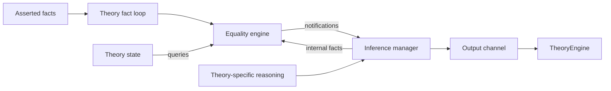

# The theory interface, equality and models

Source baseline: [2026-09-18](source-baseline.md). Read
[theory.h][theory-h] together with [theory.cpp][theory-cpp]; the base class
implements much of the protocol described here.

## Which theory receives a literal?

For ordinary theory atoms, routing selects a primary owner. In type-based
mode, a variable belongs to the theory of its type, an equality belongs to the
theory of its operands' type, and other terms are assigned by kind. In
term-based mode, non-Boolean variables go to UF and equality ownership also
depends on the owners of its two sides. If their owners differ, parametric
theories and type ownership determine the choice. This lets some equalities
be handled through cheaper congruence reasoning.

Use `Env::theoryOf` for the effective policy: it incorporates the selected
uninterpreted-sort owner and the special routing of Boolean term skolems to
UF. Calling the static helper with an assumed default can miss those cases.
“One owner” does not mean “only one theory ever sees information about this
term.” Shared terms, equalities and combination deliberately cross boundaries.

The routing implementation is in [Theory::theoryOf][theory-cpp] and
[Env][env]. The modes are declared in [theory_options.toml][options].

## The common pieces of a theory

A theory usually has a rewriter, state object and inference manager. Many also
use an official equality engine, configured through `needsEqualityEngine` and
`EeSetupInfo` and supplied before `finishInit`. The arrangement is common,
not mandatory: quantifiers and bit-vector backends can handle facts without
the usual official-engine assertion path.

`TheoryState` provides access to equality/shared-term information and conflict
state. [TheoryInferenceManager][im] connects derived facts, propagations,
conflicts and lemmas to the theory's output channel. A theory can subclass
these pieces to add queues and specialized explanations. The base `Theory`
stores the output-channel pointer; saying that the inference manager “owns
the output channel” would be misleading about C++ ownership.



This redraws the bootcamp's theory-components figure as a flow of information.
Equality notifications can also update theory-specific state; the exact
callback delegation and any pending queues depend on the theory.

Keep the kinds of output separate. An internal fact enriches local reasoning;
a propagation tells SAT that an existing literal follows from current facts;
a conflict explains an inconsistent conjunction; a lemma adds a valid
constraint, often involving new atoms. A lemma derived under assumptions must
include those assumptions as guards or otherwise use the proper conditional
inference mechanism. A bare conclusion is not made valid by being useful on
the current branch.

Sending output can cause preprocessing, SAT-atom creation and preregistration
of new terms. It can also trigger equality callbacks. Code that is midway
through updating an index must consider such reentrancy. Pending-inference
queues let a solver finish a local phase before exposing its output; they are
part of the algorithm, not incidental buffering.

## The fact-processing skeleton

`Theory::check(effort)` has an early-exit optimization for an empty queue below
full effort. Otherwise its central sequence is:

```text
if preCheck(effort): return
while facts remain and theory state is not in conflict:
    remove next fact; split into atom and polarity
    if preNotifyFact(atom, polarity, fact, isPreregistered, false):
        continue
    assert equality or predicate to the official equality engine
    notifyFact(atom, polarity, fact, false)
postCheck(effort)
```

`preCheck` returning true skips the rest of that call. `preNotifyFact`
returning true means that the theory has taken responsibility for the fact;
it skips **both** the base equality assertion and the subsequent base
`notifyFact` call. This distinction explains the quantifier and bit-blasting
implementations. Their missing work is not hidden in `notifyFact`.

The `isInternal` argument distinguishes facts inferred within the theory
from facts delivered through this input queue. Internal inference paths may
notify a theory directly. If you introduce a term in a local fact, account for
whether it has ever been preregistered; strings explicitly handles this case.

| Hook | Base behavior and intended use |
| --- | --- |
| `ppRewrite`, `ppStaticRewrite` | No theory-specific transformation by default |
| `ppAssert` | Attempts legal simple variable elimination |
| `preRegisterTerm` | No-op by default; override for triggers and indices |
| `preCheck` | Returns false; override for work before the fact queue or an early return |
| `preNotifyFact` | Returns false; override to intercept or inspect a fact |
| `notifyFact` | No-op after the equality engine accepted a fact |
| `postCheck` | No-op; often the main strategy loop in an override |
| `notifySharedTerm` | No theory-specific action; base shared-term registration still occurs |
| `getEqualityStatus` | Asks the official engine, otherwise returns unknown |

These defaults matter when the individual theory chapters say a hook is
inherited. An absent override is not evidence that an input never reaches it.

## Effort levels are a scheduling contract

`EFFORT_STANDARD` is the ordinary propagation/checking stage during Boolean
search. `EFFORT_FULL` asks theories to resolve a candidate assignment or add
the constraints needed to continue. `EFFORT_LAST_CALL` supports work after a
full-effort fixed point, frequently using a candidate model.

A solver should not eagerly run every expensive procedure on every partial
assignment. Conversely, returning from full effort with unhandled constraints
and no incompleteness signal can let an unjustified candidate escape. The
`TheoryEngine` owns the outer scheduling loop; each theory's `postCheck` and
`needsCheckLastEffort` explain its local obligations.

## Equality engines and their notifications

[EqualityEngine][ee] provides congruence closure, predicate/equality assertions,
disequalities, triggers and explanations. For registered function kinds,
equal arguments imply equal applications. A trigger predicate requests a
notification when an atom becomes true or false; a trigger term supports
sharing and notifications about equality to another tagged term.

The [notification interface][notify] distinguishes:

| Callback | Why a theory uses it |
| --- | --- |
| `eqNotifyTriggerPredicate` | Propagate a known Boolean atom |
| `eqNotifyTriggerTermEquality` | Communicate equality/disequality of tagged shared terms |
| `eqNotifyConstantTermMerge` | Report a collision between distinct canonical values |
| `eqNotifyNewClass` | Allocate or initialize metadata for a new equivalence class |
| `eqNotifyMerge` | Combine class metadata and derive consequences after a merge |
| `eqNotifyDisequal` | Record or react to a known disequality and its reason |

After a constant-term collision, the engine suspends normal work; explanations
remain available. Do not continue treating it as an ordinary consistent
congruence database. Class metadata must also backtrack with the equalities it
describes. For example, merging two singleton-set classes yields equality of
their elements; retaining that merge's metadata after SAT backtracking would
corrupt later reasoning.

[EqEngineManager][eem] handles setup and lifetime of engines. The default
policy is distributed. A central policy exists, but it is not literally one
engine replacing every theory's internal data structure: current
`Theory::expUsingCentralEqualityEngine` excludes arithmetic and arrays, and
theories may have auxiliary engines. Inspect the selected policy before
assuming two theories' engine pointers or representatives are interchangeable.

## Combination asks the equalities that matter

Theories share terms through the shared-solver and combination infrastructure.
A care pair is a pair of shared terms whose equality relationship matters to
a theory's congruence or model construction. Care graphs avoid splitting on
all possible shared-term pairs. The theory proposes relevant pairs and the
combination machinery coordinates them.

The ordinary base care-graph implementation is conservative; many theories
specialize it using application indices. Parametric operators require
compatible types as well as compatible kinds/operators. Sets focus on
membership/singleton terms, bags on counts/makes, and arrays on reads and
their indices.

`EQUALITY_FALSE_IN_MODEL` is different from an asserted disequality. It says
that the current model separates terms, not that the input entails their
inequality. Reusing a model-status answer as a proof-producing propagation
would confuse a choice of interpretation with a consequence.

## Models combine constraints from several owners

[Model management][model-manager] gathers relevant terms and theory
contributions into a [TheoryModel][model]. `computeRelevantTerms` determines
which terms must be represented; `collectModelInfo` incorporates the theory's
information and calls its value-collection hook. `collectModelValues` supplies
values or structural constraints for those terms.

A theory often contributes a *skeleton*. A datatype constructor can contain
fields owned by arithmetic; a set can contain elements whose final values
come from another theory. The model machinery must reconcile these pieces
and equality classes. Arbitrarily assigning each theory's terms in isolation
would lose shared equalities and function congruence.

Some theories need values chosen by another one first. Strings groups classes
by arithmetic length values; nested sequence element types need suitable
ordering. Separation logic has additional heap-model postprocessing even
though it does not own a distinct family of SMT value sorts. Quantifiers may
reject or refine a candidate ground model. Thus neither an inherited
`collectModelValues` nor the existence of a candidate value proves that the
whole input is satisfied.

Continue with [UF](uf.md), or choose a theory from [the guide](README.md).

[theory-h]: https://github.com/cvc5/cvc5/blob/3dcc1ef5421ab62cc1ee9af52d70042ce6861af0/src/theory/theory.h
[theory-cpp]: https://github.com/cvc5/cvc5/blob/3dcc1ef5421ab62cc1ee9af52d70042ce6861af0/src/theory/theory.cpp
[env]: https://github.com/cvc5/cvc5/blob/3dcc1ef5421ab62cc1ee9af52d70042ce6861af0/src/smt/env.cpp
[options]: https://github.com/cvc5/cvc5/blob/3dcc1ef5421ab62cc1ee9af52d70042ce6861af0/src/options/theory_options.toml
[im]: https://github.com/cvc5/cvc5/blob/3dcc1ef5421ab62cc1ee9af52d70042ce6861af0/src/theory/theory_inference_manager.cpp
[ee]: https://github.com/cvc5/cvc5/blob/3dcc1ef5421ab62cc1ee9af52d70042ce6861af0/src/theory/uf/equality_engine.h
[notify]: https://github.com/cvc5/cvc5/blob/3dcc1ef5421ab62cc1ee9af52d70042ce6861af0/src/theory/uf/equality_engine_notify.h
[eem]: https://github.com/cvc5/cvc5/blob/3dcc1ef5421ab62cc1ee9af52d70042ce6861af0/src/theory/ee_manager.h
[model-manager]: https://github.com/cvc5/cvc5/blob/3dcc1ef5421ab62cc1ee9af52d70042ce6861af0/src/theory/model_manager.cpp
[model]: https://github.com/cvc5/cvc5/blob/3dcc1ef5421ab62cc1ee9af52d70042ce6861af0/src/theory/theory_model.h
